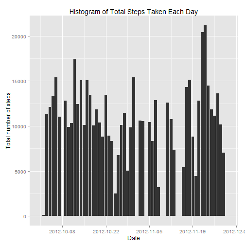
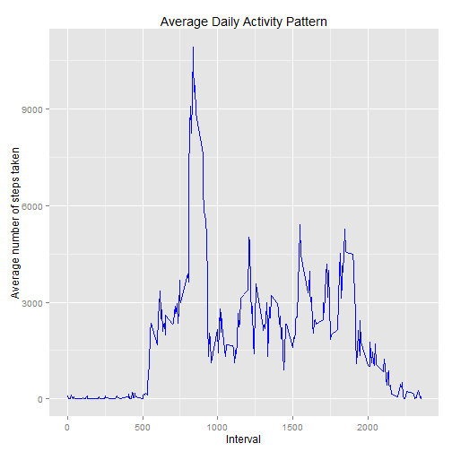
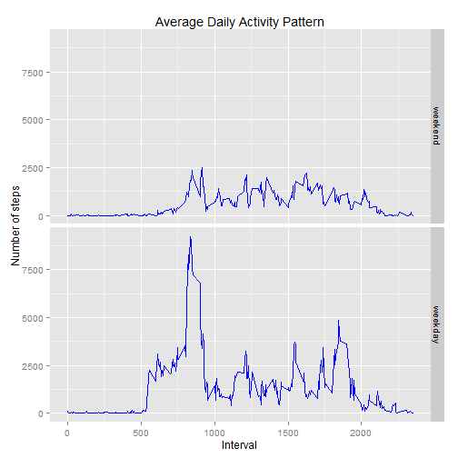

Reproducible Research: Peer Assignment 1
==================================================

##Loading and preprocessing the data

Load the data into R and reformat the date factor:

```r
library(knitr)
act_monitoring <- read.csv("./Data/activity.csv",colClasses = c("numeric", "character", "numeric"))
str(act_monitoring)
act_monitoring$date <- as.Date(act_monitoring$date, "%Y-%m-%d")
```

##What is mean total number of steps taken per day?

###1
Calculate the total number of steps taken per day and illustrate with a histogram:

```r
library(plyr)
library(ggplot2)
day_total <- ddply(act_monitoring, .(date), summarize,  totalsteps=sum(steps))
ggplot(aes(x=date, y=totalsteps,), data = day_total) +
  geom_bar(stat = 'identity', position = 'dodge') +
  scale_x_date(breaks = '2 week') +
        xlab("Date") +
        ylab("Total number of steps") +
        labs(title="Histogram of Total Steps Taken Each Day")
```

 
          
###2
Calculate the mean and median of the total number of steps taken per day:

```r
library(xtable)
mean <- mean(day_total$totalsteps, na.rm=TRUE)
median <- median(day_total$totalsteps, na.rm=TRUE)
multi.fun <- function(x) {
      c(mean = mean(x, na.rm=TRUE), median = median(x, na.rm=TRUE))
}
summary <- multi.fun(day_total$totalsteps)
summary
```

```
##     mean   median 
## 10766.19 10765.00
```
###3
The mean and median number of steps taken per day is 1.0766189 &times; 10<sup>4</sup> and 1.0765 &times; 10<sup>4</sup> respectively.


##What is the average daily activity pattern?
###1
Time series plot of the 5-minute interval and the average number of steps taken, averaged across all days


```r
day_pattern <- ddply(act_monitoring, .(interval), summarize,  intsteps=sum(steps, na.rm=TRUE))
ggplot(day_pattern, aes(x=interval, y=intsteps)) +
        geom_line(stat = "identity",color="blue") + 
        ylab("Average number of steps taken") + 
        xlab("Interval") +
        ggtitle("Average Daily Activity Pattern")
```

 

###2
Calculate the maximum number of steps on average taken during the period:

```r
max <- day_pattern[day_pattern$intsteps==max(day_pattern$intsteps),1]
```
The 5-minute interval with the maximum number of steps on average across all days is 835.

##Imputing missing values

###1
Calculate the total number of missing values in the dataset (i.e. the total number of rows with NAs):


```r
Missing <- sapply(act_monitoring, function(x) sum(is.na(x)))
Missingonly <- Missing[Missing>0]
```
There are 2304 number of missing values in the dataset.

###2
The median value for each 5 minute interval will be used to impute a value for the missing values.

###3
Replace the missing values in the original dataset:

```r
library(reshape2)
library(grDevices)
Wide_data <- dcast(melt(act_monitoring,id=c("date","interval")), date~interval)
impute.median <- function(x) replace(x, is.na(x), median(x, na.rm = TRUE))
dates <- Wide_data[,1,drop=FALSE]
replaced <- sapply(Wide_data[,2:289],impute.median)
replaced_date <- cbind(dates,replaced)
replaced_long <- melt(replaced_date,id.vars=("date"),variable.name = "interval",value.name = "steps")
replaced_long$interval <-  as.numeric(levels(replaced_long$interval))[replaced_long$interval]
```

###4
Assess the impact of the missing value treatment on the summary statistics previously reported:

```r
day_total2 <- ddply(replaced_long, .(date), summarize,  totalsteps=sum(steps))
ggplot(aes(x=date, y=totalsteps,), data = day_total2) +
  geom_bar(stat = 'identity', position = 'dodge') +
  scale_x_date(breaks = '1 week') +
        xlab("Date") +
        ylab("Total number of steps") +
        labs(title="Histogram of Total Steps Taken Each Day (after median replacement")
```

 

```r
mean2 <- mean(day_total2$totalsteps, na.rm=TRUE)
median2 <- median(day_total2$totalsteps, na.rm=TRUE)
summary2 <- multi.fun(day_total2$totalsteps)
summary2
```

```
##      mean    median 
##  9503.869 10395.000
```
The mean has decreased from 1.0766189 &times; 10<sup>4</sup> to 9503.8688525, while the median has decreased from 1.0765 &times; 10<sup>4</sup> to 1.0395 &times; 10<sup>4</sup>.
 

##Are there differences in activity patterns between weekdays and weekends?

###1
Create a new factor variable in the dataset with two levels - "weekday" and "weekend" indicating whether a given date is a weekday or weekend day:

```r
library(timeDate)
replaced_long$wDay <- factor(isWeekday(replaced_long$date, wday=1:5), 
         levels=c(FALSE, TRUE), labels=c('weekend', 'weekday'))
wday_pattern <- ddply(replaced_long, .(wDay, interval), summarize,  intsteps=sum(steps, na.rm=TRUE))
wday_pattern$interval <- as.numeric(as.character(wday_pattern$interval))
```

###2
Panel plot of the 5-minute interval and the average number of steps taken, averaged across all weekday days or weekend days.

```r
ggplot(wday_pattern, aes(x=interval, y=intsteps)) +
        geom_line(color="blue") +
        facet_grid(wDay ~ .) +
        ylab("Number of steps") + 
        xlab("Interval") +
        labs(title="Average Daily Activity Pattern")
```

 


        
   
